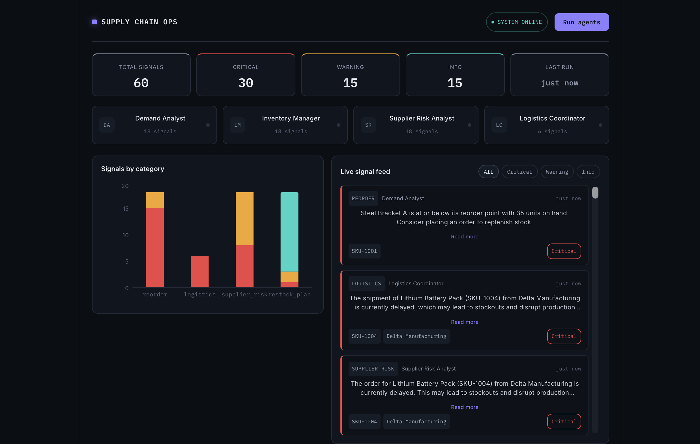
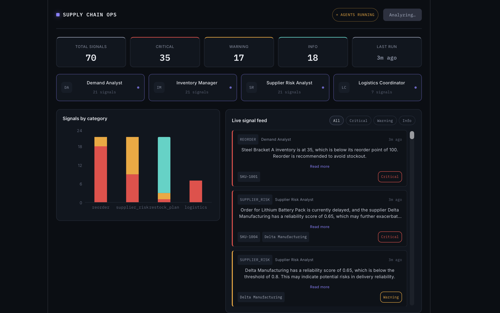
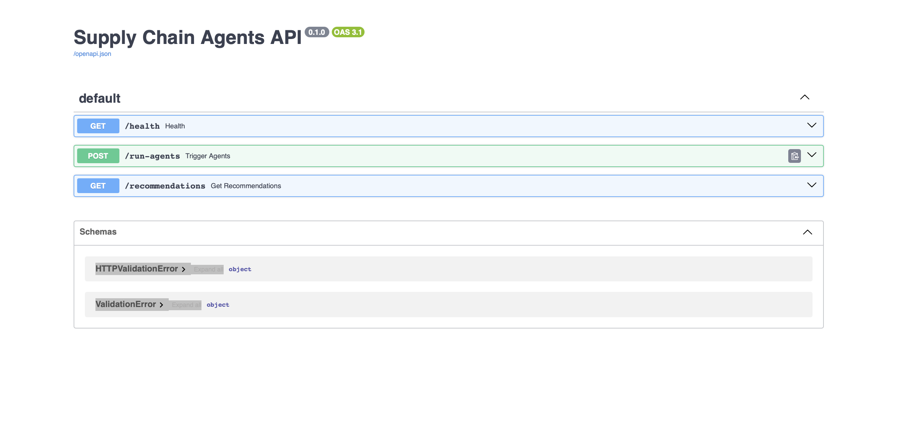

# Autonomous Supply Chain Agents

A multi-agent AI system (CrewAI) that analyzes live supply chain data —
inventory, suppliers, orders, shipments — and produces reorder plans, risk
warnings, and logistics action items in real time.

**Live demo:** https://supply-chain-agents-three.vercel.app
**API docs:** https://supply-chain-agents.onrender.com/docs



> Note: the backend runs on Render's free tier, which spins down after
> inactivity. The first request after idle time can take 30–60 seconds to
> wake up — this is expected, not a bug.

## What it does

Four specialized AI agents run sequentially against live Supabase data:

- **Demand Analyst** — flags products at risk of stockout based on current
  inventory vs. reorder points
- **Inventory Manager** — recommends reorder quantities and the best
  supplier by reliability and lead time
- **Supplier Risk Analyst** — flags unreliable suppliers and delayed orders
- **Logistics Coordinator** — tracks shipment delays and suggests next steps

Results are written back to Supabase and displayed live in a React
dashboard, triggered on demand with a single click.

## Architecture
Supabase (Postgres)
│
▼
CrewAI crew — 4 agents, sequential process, powered by Groq (Llama 3.3 70B)
│  writes recommendations back to Supabase
▼
FastAPI  —  /run-agents (POST)  ·  /recommendations (GET)  ·  /health
│
▼
React + Recharts dashboard  —  KPI cards, agent status rail, live signal feed



## Stack

| Layer | Technology |
|---|---|
| Database | Supabase (Postgres) |
| Agents | CrewAI + Groq (Llama 3.3 70B) |
| Backend | FastAPI |
| Frontend | React + Vite + Recharts |
| Deployment | Render (backend) · Vercel (frontend) |

## Run locally

### Backend
```bash
cd backend
python3 -m venv venv
source venv/bin/activate
pip install -r requirements.txt
```
Create `backend/.env`:
GROQ_API_KEY= your_groq_key
SUPABASE_URL= your_supabase_url
SUPABASE_KEY= git add -A
git statusyour_supabase_secret_key
```bash
uvicorn main:app --reload --port 8000
```

### Frontend
```bash
cd frontend
npm install
```
Create `frontend/.env`:
VITE_API_URL=http://localhost:8000
```bash
npm run dev
```



## Database schema

Six tables in Supabase: `suppliers`, `products`, `inventory`, `orders`,
`shipments`, and `agent_recommendations` (where agent output is persisted,
keyed by `run_id`).

## Author

**Tirthankar**